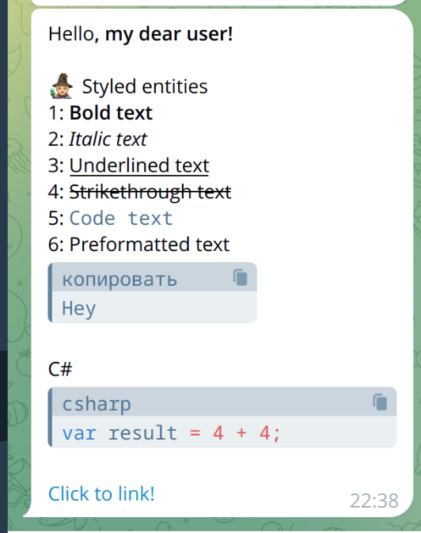

# Telegram Message Builder for .NET
[](https://badge.fury.io/nu/Telegram.Bot.Messages)
[](https://github.com/viklover/Telegram.Bot.Messages/blob/master/LICENSE.txt)


Simple message builder for the [Telegram.Bot .NET client](https://github.com/TelegramBots/Telegram.Bot) that simplifies creating messages with [styled entities](https://core.telegram.org/api/entities) and splitting long messages to comply with Telegram's limits.



## 🚀 Quick start
Installation:
```csharp
dotnet add package Telegram.Bot.Messages --version 1.0.0
```
Example usage:
```csharp
var builder = new MessageBuilder();
builder.Append("Hello");
builder.AppendBoldLine(", my dear user!");
builder.AppendLine();
builder.AppendParagraph("🧙 Styled entities", (MessageBuilder printer) => {
    printer.AppendField("1", value => value.AppendBold("Bold text"));
    printer.AppendField("2", value => value.AppendItalic("Italic text"));
    printer.AppendField("3", value => value.AppendUnderlined("Underlined text"));
    printer.AppendField("4", value => value.AppendStrikethrough("Strikethrough text"));
    printer.AppendField("5", value => value.AppendCode("Code text"));
    printer.AppendField("6", value => value.Append("Preformatted text").AppendPreformatted("Hey"));
});
builder.AppendLine("C#");
builder.AppendPreformattedLine("var result = 4 + 4;", "csharp");
builder.AppendLine();
builder.AppendLink("Click to link!", new Uri("https://google.com"));
builder.AppendLine();

var message = builder.Build();

// send message with styled entities
await bot.SendMessage(chatId, message.Content, entities: message.Entities);

// for long messages: split by paragraphs (handles text+attachments)
var slices = builder.Build(MessageSplitStrategy.Paragraph, MessageContentType.TextWithAttachments);
foreach (var message in slices) {
    await bot.SendMessage(chatId, message.Content, entities: message.Entities);
}
```

## 📚 Features
### ✅ Supported entities

| Message entity    | State           |
|-------------------|-----------------|
| Bold              | ✅ Supported     |
| Italic            | ✅ Supported     |
| Code              | ✅ Supported     |
| Strike            | ✅ Supported     |
| Underline         | ✅ Supported     |
| Preformatted text | ✅ Supported     |
| Mention user name | ⏳ Not supported |
| Custom emoji      | ⏳ Not supported |

### 📏 Message Splitting
Easily split long messages using different strategies
| Split strategy | Description               |
|----------------|---------------------------|
| By word        | Splits at word boundaries |
| By line        | Splits at line breaks     |
| By paragraph   | Splits between paragraph  |


### ⚠️ Size Limitations
Telegram enforces different limits based on message type:

| Message Type       | Character Limit  |
|--------------------|------------------|
| With attachments   | 1024             |
| Text-only messages | 4096             |

Specify `MessageContentType` when splitting:
```csharp
var slices = builder.Build(
    MessageSplitStrategy.Paragraph, 
    MessageContentType.TextWithAttachments
);
```

## 🛠️ API Reference
Core Methods
```csharp
MessageBuilder Append(char symbol)
MessageBuilder Append(MessageBuilder builder)
MessageBuilder AppendLine()
MessageBuilder AppendLine(string text)

MessageBuilder AppendBold(string text, bool nl = false)
MessageBuilder AppendBoldLine(string text)

MessageBuilder AppendItalic(string text, bool nl = false)
MessageBuilder AppendItalicLine(string text)

MessageBuilder AppendUnderlined(string text, bool nl = false)
MessageBuilder AppendUnderlinedLine(string text)

MessageBuilder AppendStrikethrough(string text, bool nl = false)
MessageBuilder AppendStrikethroughLine(string text)

MessageBuilder AppendPreformatted(string text, string? lang = null, bool nl = false)
MessageBuilder AppendPreformattedLine(string text, string? lang = null)

MessageBuilder AppendCode(string code, bool nl = false)
MessageBuilder AppendCodeLine(string code, bool nl = false)

MessageBuilder AppendLink(string label, Uri uri, bool nl = false) 
MessageBuilder AppendLinkLine(string label, Uri uri)

MessageBuilder AppendField(string name, string value, bool nl = true, bool boldTitle = false)
MessageBuilder AppendField(string name, Action<MessageBuilder> printer, bool nl = true, bool boldTitle = false)

MessageBuilder AppendParagraph(Action<MessageBuilder> printer, bool nl = true)
MessageBuilder AppendParagraph(string? title, Action<MessageBuilder> printer, bool nl = true, bool boldTitle = false)

MessageBuilder TrimEnd()

MessageSlice Build()
MessageSlice[] Build(MessageSplitStrategy splitStrategy, MessageContentType contentType)
```

## 🛠️ Contribution
We welcome contributions! Please feel free to:
* Report bugs 🐛
* Suggest features 💡
* Submit pull requests 🔄

